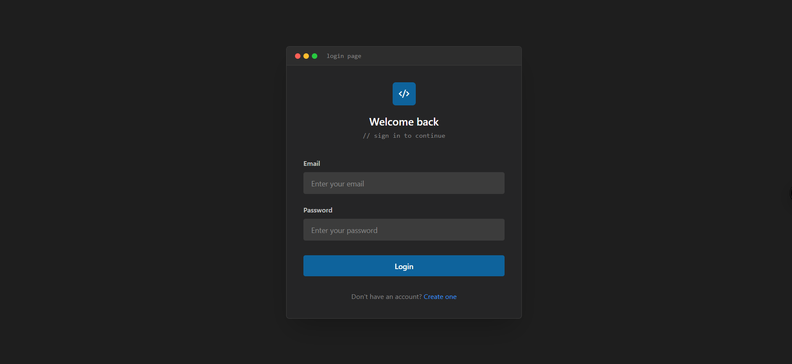
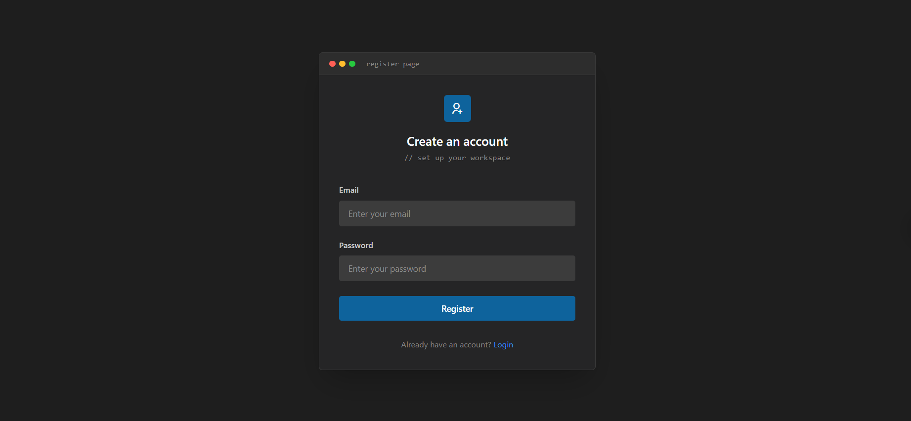
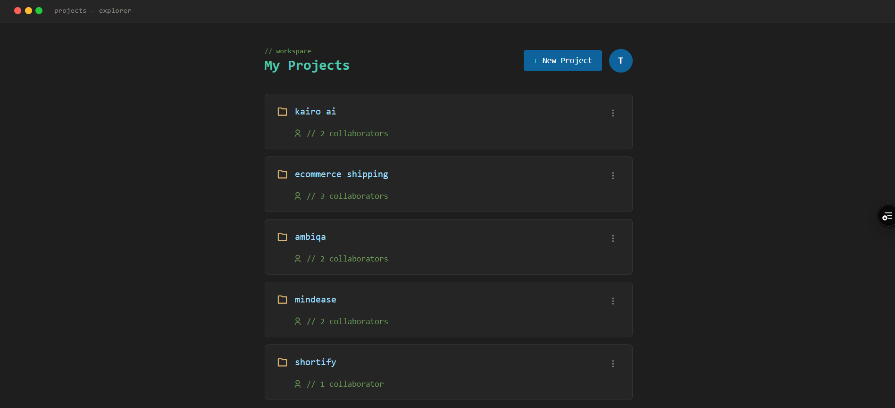
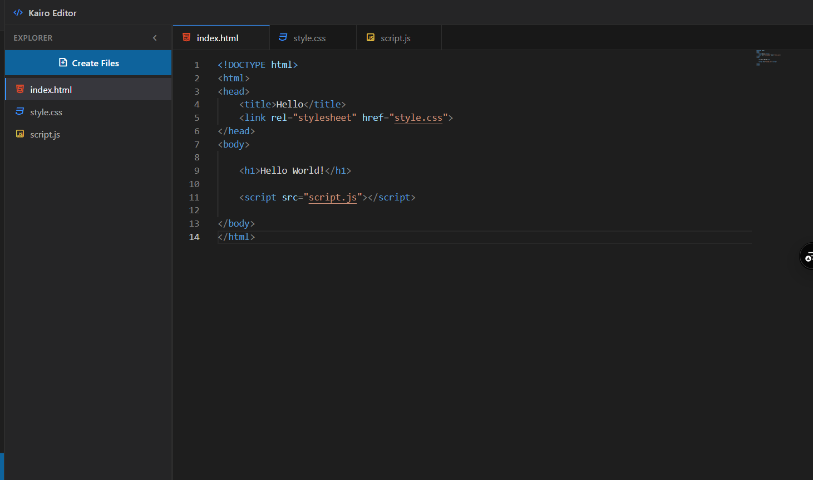
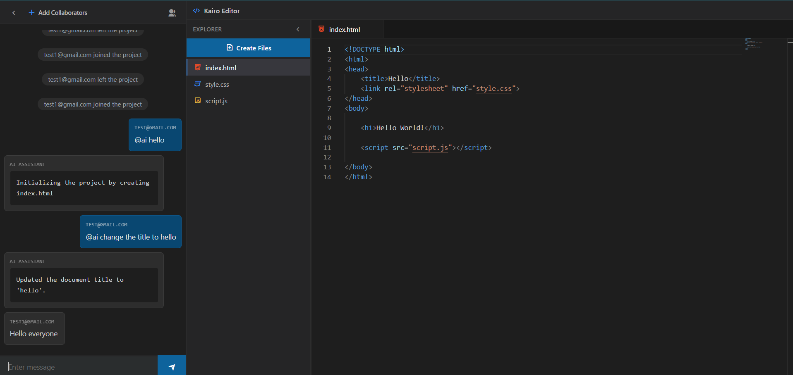
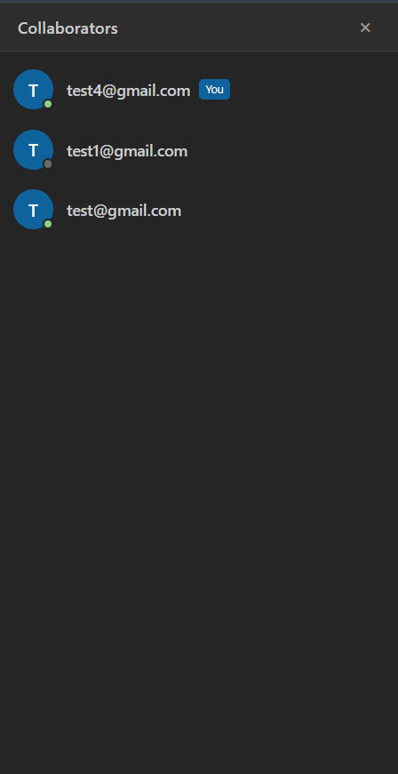
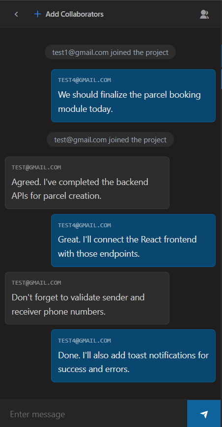

<div align="center">

# 🚀 Kairo

### Real-Time Collaborative Coding Platform with AI Assistance

A full-stack collaborative coding platform that enables developers to create projects, collaborate with teammates in real time, communicate through integrated project chat, and leverage an AI assistant for code generation and editing—all within a shared workspace.

**React • Node.js • Express.js • MongoDB • Socket.IO • Redis • Google Gemini AI**

[Live Demo](https://kairo-eta-three.vercel.app)

</div>

---

## ✨ Features

### 👤 User Authentication
- Secure user registration and login
- JWT-based authentication
- Protected routes for authenticated users

### 📁 Project Management
- Create new coding projects
- View all owned and shared projects
- Access projects from a centralized dashboard

### 👥 Collaboration
- Invite collaborators to projects
- View project members
- Shared workspace for all collaborators

### 💬 Real-Time Project Chat
- Instant messaging using Socket.IO
- Team communication within each project
- Live updates without refreshing the page

### 🤖 AI Coding Assistant
- Powered by Google Gemini AI
- Generate code using `@ai` prompts
- Modify existing code through natural language instructions
- AI responses appear directly in the project conversation

### 💻 Code Editor
- Monaco Editor integration
- Multi-file workspace
- HTML, CSS and JavaScript editing
- File explorer for project files

### ⚡ Performance
- Redis integration for caching
- Responsive user interface
- Deployed frontend and backend

---

# 📸 Application Preview

## 🔐 Authentication

<table>
<tr>
<td width="50%">

### Login



</td>

<td width="50%">

### Register



</td>
</tr>
</table>

---

## 📂 Project Dashboard



Manage projects, create new workspaces, and access collaborative coding sessions from a centralized dashboard.

---

## 💻 Collaborative Code Editor



A Monaco-powered editor with a project explorer and support for editing multiple project files.

---

## 🤖 AI Coding Assistant



Interact with Google Gemini AI using natural language prompts to generate code or modify existing files within the project workspace.

---

## 👥 Collaborator Management



Invite teammates and view project collaborators.

---

## 💬 Real-Time Chat



Communicate with collaborators instantly while working on the same project.

---

# 🏗️ Tech Stack

## Frontend

- React.js
- React Router
- Tailwind CSS
- Monaco Editor
- Axios
- Socket.IO Client

## Backend

- Node.js
- Express.js
- JWT Authentication
- Socket.IO
- Redis

## Database

- MongoDB
- Mongoose

## AI

- Google Gemini API

## Deployment

- Vercel
- Render

---

# 📂 Project Structure

```text
client/
├── src/
│   ├── components/
│   ├── pages/
│   ├── context/
│   ├── hooks/
│   └── utils/

server/
├── controllers/
├── models/
├── routes/
├── middleware/
├── services/
├── socket/
└── config/
```

---

# ⚙️ Installation

## Clone the repository

```bash
git clone https://github.com/yourusername/kairo.git
cd kairo
```

---

## Backend Setup

```bash
cd server

npm install

npm run dev
```

Create a `.env` file:

```env
PORT=3000

MONGODB_URI=YOUR_MONGODB_URI

JWT_SECRET=YOUR_SECRET

REDIS_URL=YOUR_REDIS_URL

GOOGLE_API_KEY=YOUR_GEMINI_API_KEY
```

---

## Frontend Setup

```bash
cd client

npm install

npm run dev
```

---

# 🚀 Future Improvements

- Collaborative cursor presence
- Real-time code synchronization between collaborators
- Additional programming language support
- Version history
- Syntax execution and output preview

---

# 👨‍💻 Author

**Tilak Shailendra Bhandari**

- LinkedIn
- GitHub

---

## ⭐ Support

If you found this project useful, consider giving it a ⭐ on GitHub.
